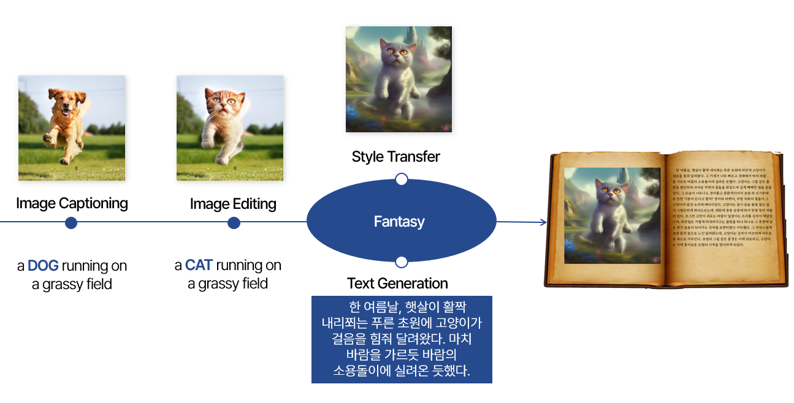
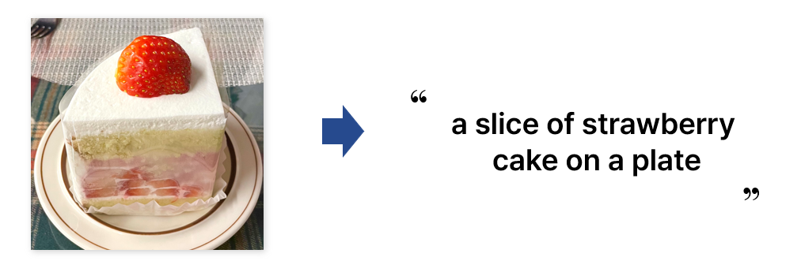
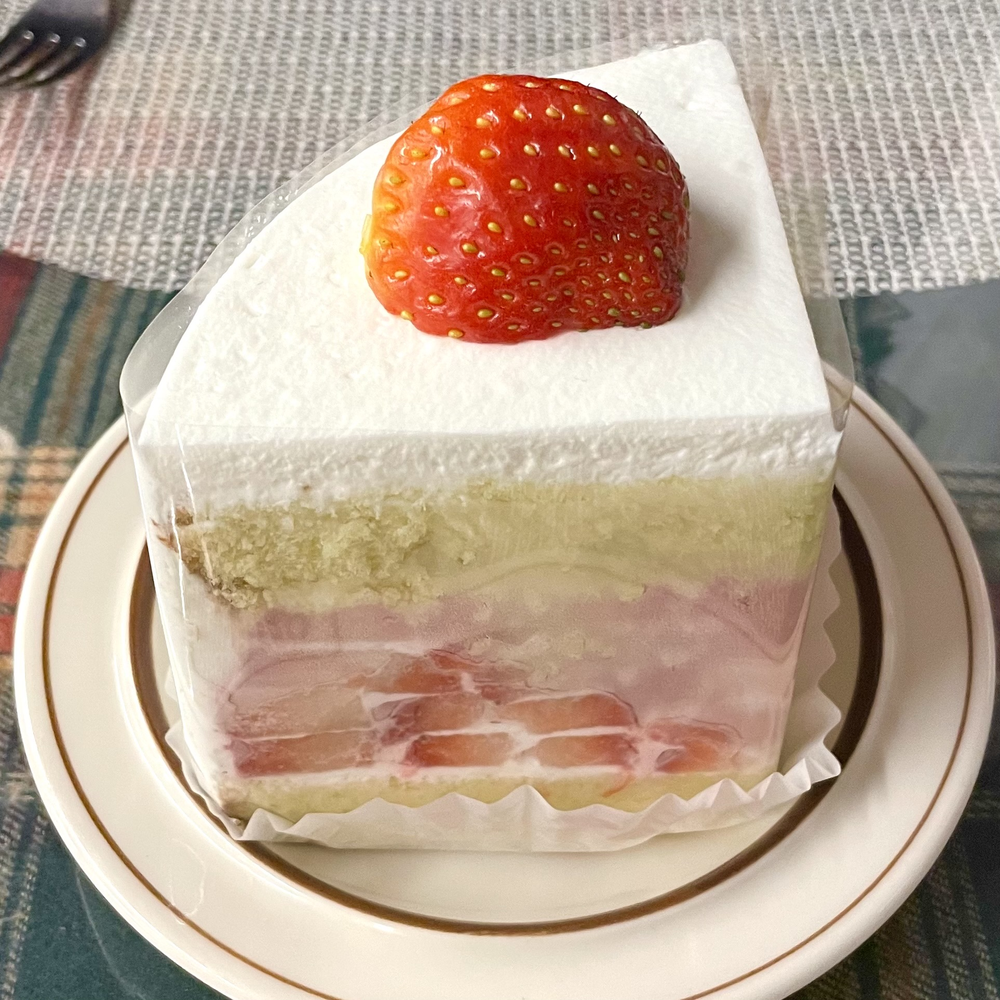
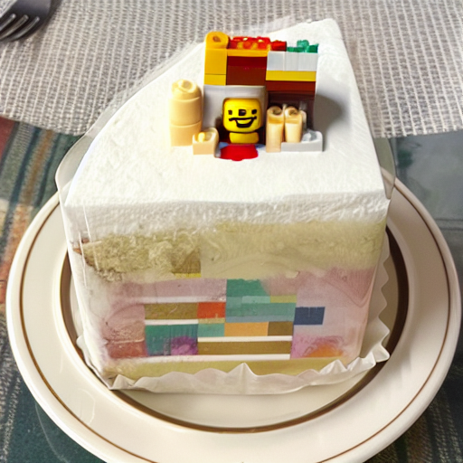
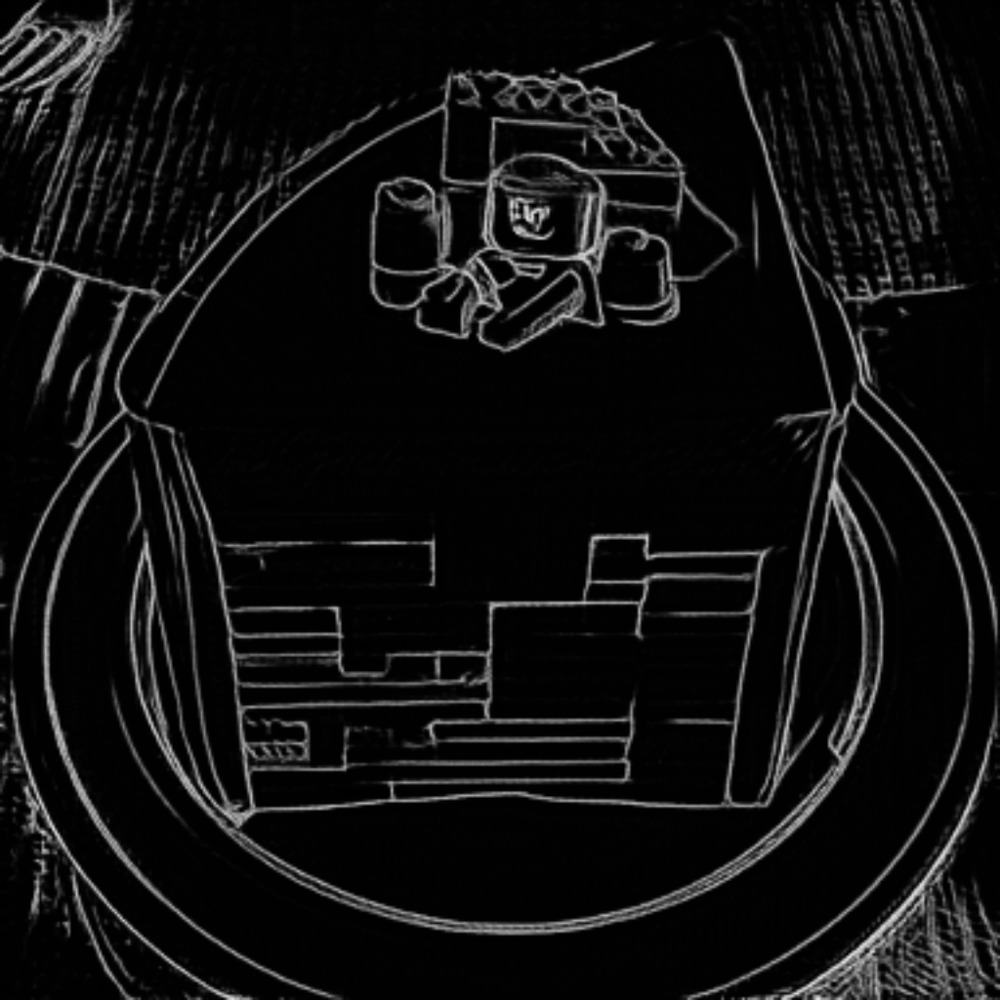
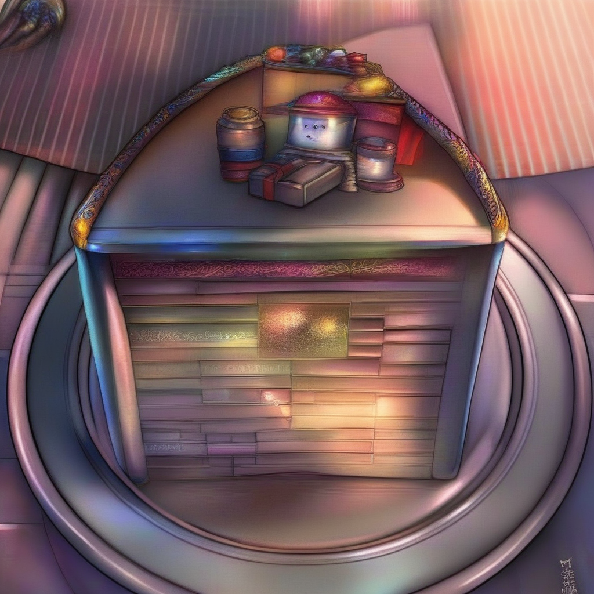
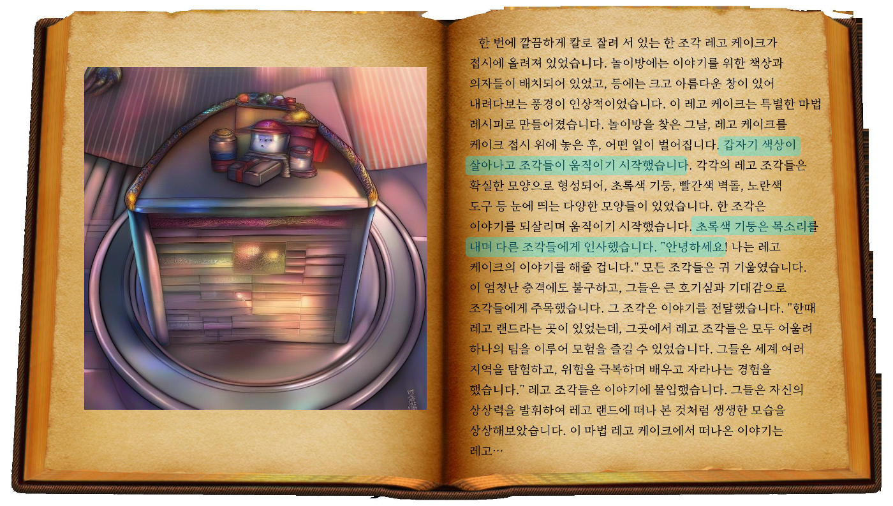

# The Imagination becomes a reality
> To create your own Novel based on Text Generation and Image Editing

## Overview
Do you imagine a lot? We often imagine, "What if...". We decided to create an edited an image-based novel because it was regrettable that these imaginations could only be imagined in our heads were quickly forgotten. 
If you want to see the full code of our project, please refer to [Custom_Novel.ipynb](https://github.com/deepdaiv-multimodal/23f-custom-img-to-text/blob/main/Custom_Novel.ipynb).

Our project consists of a four stages, and the flow is as follows.

Illustrations and novel creation consist of four stages.

### STEP 1 : Image Captioning
First, We proceed with image captioning for the input image. We used [BLIP-2](https://github.com/salesforce/LAVIS/tree/main/projects/blip2) model. The next steps also include prompts for the image, so we thought **it was important to use accurate and consistent captions**, so we used the image captioning model.

#### Loading Model
We uses the `blip2_opt-2.7b` weights.
```bash
from transformers import Blip2Processor, Blip2ForConditionalGeneration

processor = Blip2Processor.from_pretrained("Salesforce/blip2-opt-2.7b")
model = Blip2ForConditionalGeneration.from_pretrained("Salesforce/blip2-opt-2.7b")
     
```
Image Captioning result is as follows.


### STEP 2 : Image Editing
Second, Editing the input image as desired by the users.
We used [Null text Inversion](https://github.com/google/prompt-to-prompt?tab=readme-ov-file#null-text-inversion-for-editing-real-images) model. We used captions from STEP 1. **Editing will be done only with prompts.**

Four parameters are used, each of which means the following

- `cross_replace_steps`: specifies the fraction of steps to edit the cross attention maps. Can also be set to a dictionary [str:float] which specifies fractions for different words in the prompt.
- `self_replace_steps`: specifies the fraction of steps to replace the self attention maps.
- `blend_word` : part you want to edit and the part you want to edit.
- `eq_params` : A variable that controls the attention value. In other words, you can increase the value as much as you want to amplify

For example, if you want to change **strawberry cake** to a **Lego cake**, you can add the code as below.
```bash
prompts = ["a slice of strawberry cake on a plate",
           "a slice of lego cake on a plate"]

cross_replace_steps = {'default_': .8,}
self_replace_steps = .4
blend_word = ((('strawberry',), ('lego',)))
eq_params = {"words": ("lego",), "values": (2,)}
```

The result is as follows.
| Original Image                 | Edited Image                           |  
|--------------------------------|----------------------------------------|
| <p align="center"></p>| <p align="center"></p> |


### STEP 3 : Style Transfer
Our project aimed to **create fantasy novels**, so we thought that novel illustrations should also be fantasy images. Therefore, we wanted to **keep the original images intact**, but only change the image style.

So, after the pre-processing process of extracting lineart using the [T2I-Adapter model](https://github.com/TencentARC/T2I-Adapter), style transfer was performed with fantasy art.
```bash
prompt = 'Fantasy art'
# Extracting lineart
image = line_detector(Image.open('./data/edited_image.png'), detect_resolution=384, image_resolution=1024)

# style transfer
gen_images = pipe(
        prompt=prompt,
        negative_prompt=negative_prompt,
        image=image,
        num_inference_steps=30,
        adapter_conditioning_scale=0.8,
        guidance_scale=7.5,).images[0]
```

The result is as follows.
| Original Image                  | Lineart                            | Style Transfer                                |
|---------------------------------|------------------------------------|-----------------------------------------------|
| <p align="center"></p> | <p align="center"></p> | <p align="center"></p>|

### STEP 4 : Text Generation
Finally, create a fantasy novel. When creating fantasy novels, we used the GPT API to generate text and translate Korean. At that stage, we created novels based on captions by adding captions used in edited images.

```bash
client = OpenAI(api_key=api_key)
messages=[
    {"role": "system", "content": "You are a creative storyteller."},
    {"role": "system", "content": "The following story is a fantasy."},
    {"role": "user", "content": caption},
    {"role": "assistant", "content": "한국어로 번역된 이야기:"}
    ]
    
```

The final fantasy novel book that edited the image and built on it is as follows.

